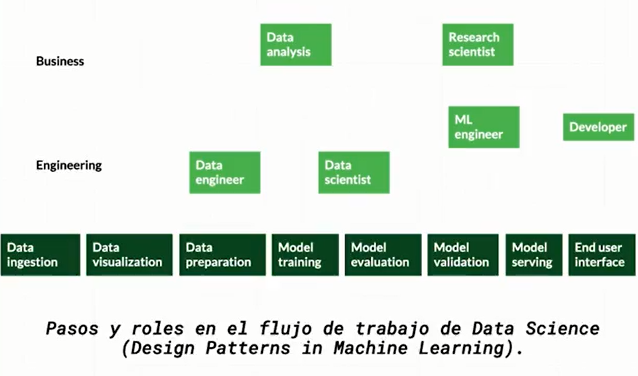

# ESTADÍSTICA DESCRIPTIVA

[Deepnote](https://deepnote.com/workspace/data-science-platzi-bb6b-6737cd13-9007-4796-b0fa-12d385ed19f5/project/clases-7a836fa9-7c64-413b-a4c8-69c9a09a110b/)

## INTRODUCCIÓN

| Estadística Descriptiva | Estadística inferencial |
| --- | --- |
| Resumir información. Recoge la información y las diferentes métricas | Hacer inferencias: sacar conclusiones de cosas que pueden pasar con base en los eventos o datos |
| Problema: podemos mentir con la información ya que no hay una definición objetiva | Predecir |
| Los diferentes estadísticos descriptivos dan nociones diferentes sobre los mismos datos. |  |

“Con frecuencia consturimos un caso estadístico con datos imperfectos, como resultado hay numerosas razones por las cuales individuos intelectuales respetables pueden no estar de acuerdo sobre los resultados estadísticos”. *El gran problema de la estadística descriptiva (Naked Statistics, Charles Wheelan)*

### ¿Por qué aprender estadística?

- Resumir grandes cantidades de información
- Tomar mejores decisiones (¿o peores?)
- Responder preguntas con relevancia social. Siempre tienen respuesta con base a la estadística descriptiva
- Reconocer patrones en los datos
- Descubrir a quienes usan estas herramientas con fines nefastos.

### Flujo de trabajo en data Science

1. Ingesta de datos y validación: Primero tenemos que identificar en un dataset cuales son los **tipos de datos** y el **pipeline (flujo) de procesamiento**, el cual va a definir cuales son las transformaciones que debemos hacer sobre los datos para que queden limpios y adaptados a lo que necesita el modelo que yo como científico de datos tengo claro que se va a necesitar para resolver un problema puntual de negocio.
2. Preparación de data y entrenamiento del modelo: fase donde termino de procesar los datos y empiezo a construir el modelo. Vamos a hacer un **análisis exploratorio** de los datos, utilizar **estadística descriptiva** en ese análisis, buscar **correlaciones** entre los datos y, con base en eso hacer posibles reducciones de datos.
3. Evaluación de modelo, modelo en producción y como este modelo termina interactuando con el usuario final (validación del modelo): aquí hay elementos de estadística como la **probabilidad y la inferencia**; y en particular algo que se usa mucho para probar modelos es el **test de hipótesis** (estadística inferencial).

## ESTADÍSTICA EN LA INGESTA DE DATOS

### Tipos de datos

Todos los datos existen en 2 categorías fundamentales:

- Categóricos: género, categoría de película, método de pago
    - Ordinal: cuando exise una relación de orden entre las categorías
    - Nominal
- Numéricos: edad, altura, temperatura
    - Discretos: tipos de variables enteras (int)
    - continuos: tipos de variables flotantes (float)

Un notebook es un ambiente ideal para explorar la información.

Los tipos de datos se identifican de la siguiente manera:

- Categóricos:
    - `object`: es una variable textual que NO son números
    - `bool`: True y False
- Numéricos:
    - `int64`: Numérico. Formato por defecto de pandas para las variables numéricas.
    - `float64`: Formato por defecto de pandas para las variables continuas.

